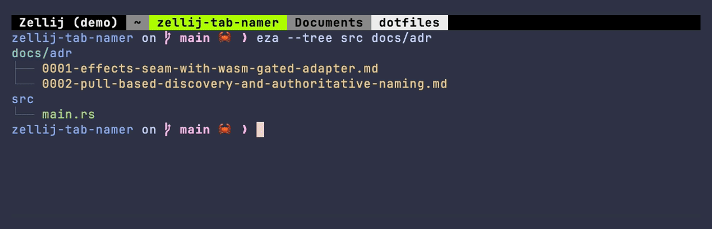
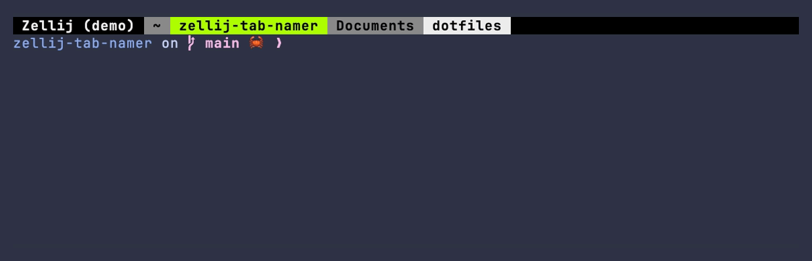

# zellij-tab-namer

A [Zellij](https://zellij.dev) plugin that names each tab after the folder its panes are in, or
after the git repository when that folder sits inside one, and keeps that name up to date as you
`cd` around. Instead of `Tab #1` and `Tab #2`, your tabs read `Downloads`, `myrepo`, `~`.

It also exposes a small pipe API, so another tool can put a prefix or a suffix around that name
without fighting the plugin over it.

<p align="center">
  <a href="https://github.com/vmaerten/zellij-tab-namer/actions/workflows/ci.yml"></a>
  
  
</p>

<p align="center">
  
</p>

## What is it?

Past three or four tabs, the default `Tab #N` names stop telling you anything. This plugin watches
the pane that speaks for each tab and renames the tab after where that pane actually is:

- the folder it sits in (`Downloads`)
- the repository name instead, when that folder is inside a git repo (`myrepo`)
- `~` when it's your home directory

Naming doesn't wait for a `cd`. It happens at session start, when you open a tab and when a layout
is restored, so a session is already labelled by the time you look at it.

Zellij lets only one plugin own a tab's name, and two plugins writing to it produce flickering
renames. So anything else that wants to show something on a tab has to decorate the name rather
than replace it, which is what the pipe API is for.
[`zellij-agent-activity`](https://github.com/vmaerten/zellij-agent-activity) uses it to show what an
AI coding agent is up to, as `⚡ myrepo`.

## Requirements

- Zellij 0.44.3 or later (`zellij --version`).
- `git` on your `PATH`, only if you want repository names. Without it, tabs stay on folder names,
  and `git_detection false` skips git entirely.

## Install

```sh
# Download the wasm from the latest release into your plugins dir
curl -L -o ~/.config/zellij/plugins/zellij-tab-namer.wasm \
  https://github.com/vmaerten/zellij-tab-namer/releases/latest/download/zellij-tab-namer.wasm
```

> Rather build it yourself? `cargo wasm` produces the same file, see
> [Development](#development). Drop it into `~/.config/zellij/plugins/`.

Load it in `~/.config/zellij/config.kdl`:

```kdl
load_plugins {
    "file:~/.config/zellij/plugins/zellij-tab-namer.wasm";
}
```

Restart Zellij and grant the plugin's permissions when prompted. Tabs start renaming themselves.

## Configuration

Options go in a config block on the plugin. Both are optional:

```kdl
load_plugins {
    "file:~/.config/zellij/plugins/zellij-tab-namer.wasm" {
        git_detection true            // name tabs after the git repo (default: true)
        pane_count " ({pane_count})"  // suffix shown only when a tab has >1 pane (default: off)
    }
}
```

| Option | Default | Effect |
|---|---|---|
| `git_detection` | `true` | Name a tab after its git repo. Set `false` to always use the folder name and skip running `git`. |
| `pane_count` | *(unset)* | A format string appended when a tab holds more than one pane. `{pane_count}` is replaced with the count. Unset means no suffix. |

## Decoration pipe API

<p align="center">
  
</p>

Another tool decorates a tab by sending a pipe message. The rendered tab name is always put together
the same way:

```
{prefix}{base name}{suffix}{pane-count suffix}
```

Decorations are stored per tab and re-applied every time the base name is recomputed, so they
survive a `cd`.

| Pipe name | Args | Effect |
|---|---|---|
| `set_prefix` | `value`, `tab_id` | Set the tab's prefix to `value`. |
| `set_suffix` | `value`, `tab_id` | Set the tab's suffix to `value`. |
| `clear_prefix` | `tab_id` | Remove the prefix. |
| `clear_suffix` | `tab_id` | Remove the suffix. |
| `clear_all` | `tab_id` | Remove both. |

`tab_id` is a stable Zellij tab id. Omit it, or pass `active`, to target whichever tab is active.

```sh
# Prefix the active tab
zellij pipe --name set_prefix --args "value=🔨 "

# Suffix a specific tab by id
zellij pipe --name set_suffix --args "tab_id=3,value= [build]"

# Clear it
zellij pipe --name clear_all --args "tab_id=3"
```

## How naming works

A tab's base name comes from the cwd of the pane that speaks for it, normally the focused pane of
the visible layer, with fallbacks when there isn't one. From that cwd the plugin takes the
directory's own name, or `~` when it is `$HOME`. When the directory turns out to be inside a git
repository, the repository's top-level folder name wins instead, since that is nearly always the
name you have in mind.

To name a tab before any `cd` happens, the plugin issues a one-shot discovery query for its cwd at
session start, on new tabs and on restore. After that it follows `cd` through Zellij's `CwdChanged`
event and resolves git roots with a cached `git rev-parse`. Panes asking about the same cwd share a
single query, and symlinked cwds resolve through a root-alias cache.

One limitation is deliberate: running `git init` in a folder the session has already visited goes
unnoticed until the session restarts, because the "not a repo" verdict is cached and never
invalidated. The ADRs cover why.

## Development

```sh
cargo test    # the pure core, no zellij needed
cargo wasm    # release build -> target/wasm32-wasip1/release/zellij-tab-namer.wasm
task ci       # what CI runs: fmt, clippy, test, wasm build (needs go-task)
```

The plugin is a pure core that turns Zellij events into a `Vec<Effect>`, plus a thin wasm-gated
adapter that runs those effects against the host. Since the host functions only exist on wasm, the
linker enforces the split, which is what makes the timing-sensitive naming logic testable with a
plain `cargo test` rather than in a live session. See
[ADR-0001](docs/adr/0001-effects-seam-with-wasm-gated-adapter.md).

- [`docs/CONTEXT.md`](docs/CONTEXT.md) covers the vocabulary: base name against rendered name,
  decoration, waiter, discovery query.
- [`docs/adr/`](docs/adr) holds the architecture decision records.

## License

MIT, see [`LICENSE`](LICENSE).
